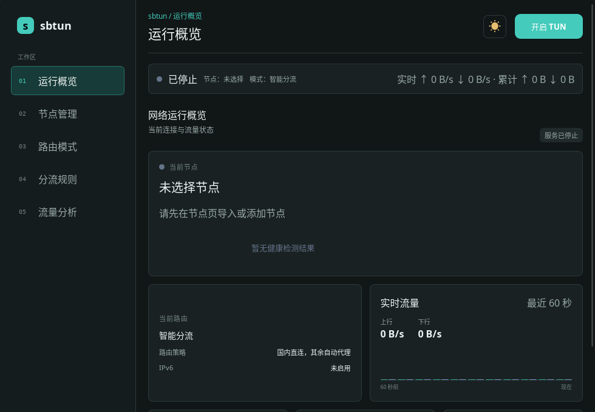
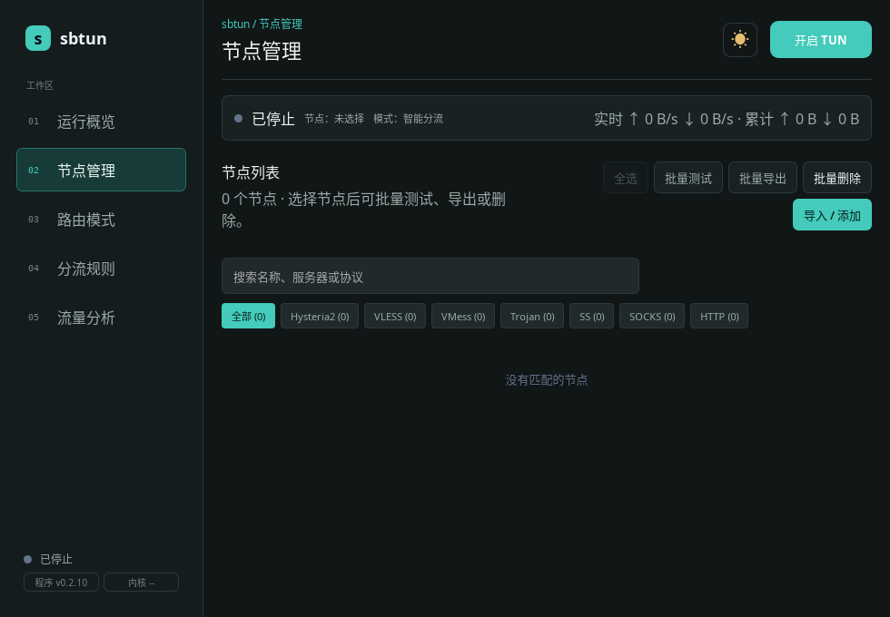
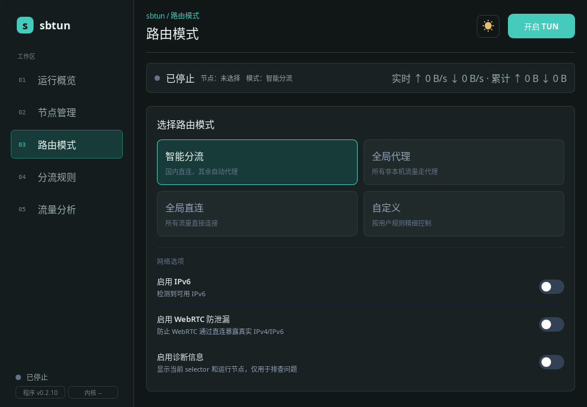
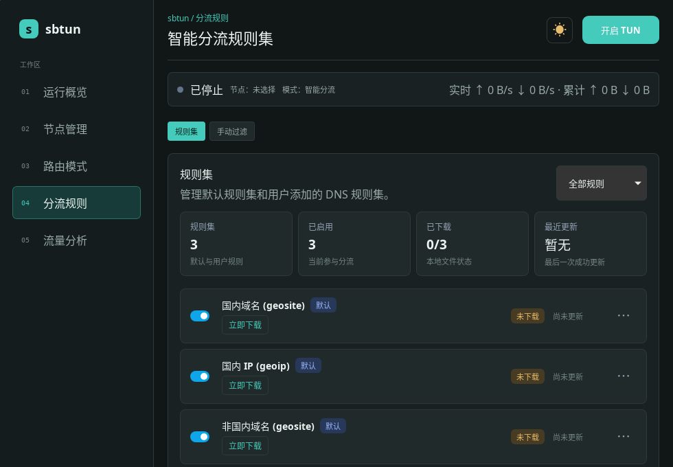
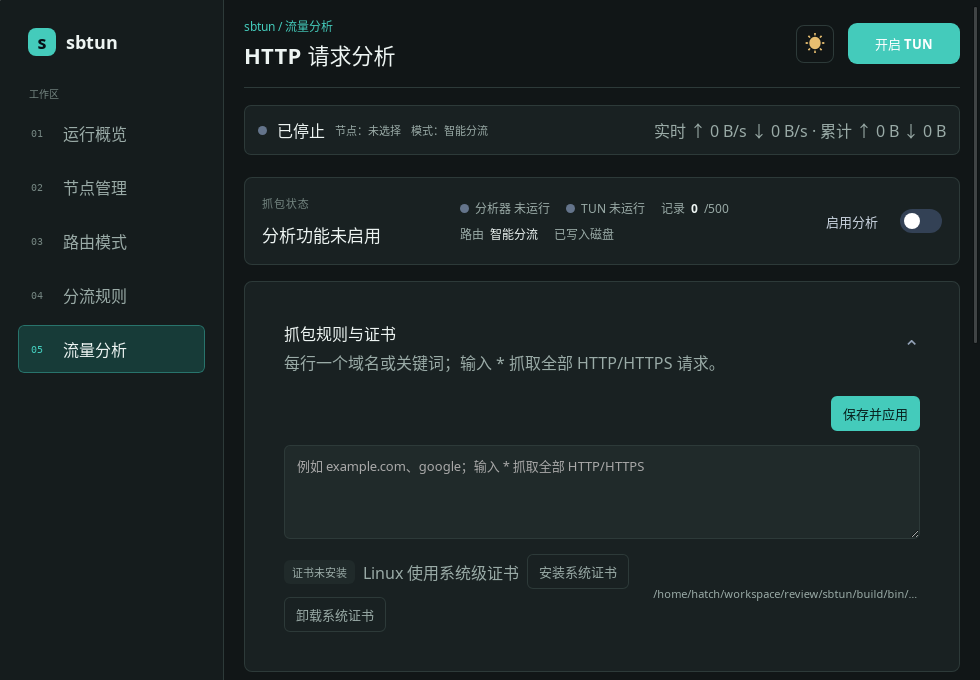

# sbtun

轻量级 sing-box TUN 客户端，为 Windows 和 Linux 提供桌面 GUI，同时保留适合脚本与服务器环境的 CLI。

sbtun 负责节点、订阅、路由、规则集、健康检查和运行状态；代理内核由 sing-box 提供。用户配置与 sing-box 运行配置分离，不需要手写底层 JSON。

## 主要特性

- **桌面与命令行双入口**：GUI 和 CLI 共用配置与运行状态。
- **常用协议支持**：VLESS、VMess、Trojan、Shadowsocks、Hysteria2、SOCKS 和 HTTP。
- **节点管理**：导入节点链接或订阅、手动编辑、批量测试、批量导出与删除。
- **四种路由模式**：智能分流、全局代理、全局直连和自定义规则。
- **规则集管理**：更新、启停和管理 sing-box SRS 规则集，并支持手动 DNS 过滤规则。
- **真实可用性检查**：区分 Ping、TCP/UDP 端口探测与实际代理 URL 测试。
- **运行时切换与容错**：运行中切换节点、节点失效检测和自动切换。
- **流量分析**：按域名或关键词查看经过 TUN 的 HTTP/HTTPS 请求，并保存为 JSON。
- **便携发布包**：GitHub Actions 构建 Windows/Linux 的 amd64 与 arm64 版本。

## 界面预览







以上为深色主题下的五个导航页面。截图取自空配置环境，因此没有真实节点、流量和曲线；实际使用时各页面会显示实时数据。

---

## 快速开始

### Windows

1. 在本仓库的 **Releases** 页面下载 `sbtun-windows-amd64.zip` 或 `sbtun-windows-arm64.zip`。
2. 完整解压压缩包，不要只复制 `sbtun.exe`。
3. 使用管理员权限运行：

```powershell
.\sbtun.exe
```

命令行入口：

```powershell
.\sbtun-cli.exe help
.\sbtun-cli.exe status
```

Windows 发布包包含 sing-box、Wintun DLL 和默认分流规则集。TUN 模式需要管理员权限。

### Linux

1. 在本仓库的 **Releases** 页面下载对应架构的 `.tar.gz` 发布包。
2. 解压后使用启动脚本：

```bash
chmod +x start-sbtun.sh
./start-sbtun.sh
```

脚本会优先通过 `pkexec` 获取权限，不可用时尝试 `sudo`。命令行入口：

```bash
chmod +x sbtun-cli
./sbtun-cli help
```

> [!NOTE]
> Linux GUI 依赖 GTK3/WebKitGTK。官方发布包带有配套运行库和启动脚本；只复制 GUI 主程序可能导致 `libwebkit2gtk-4.0.so.37` 缺失。

### 首次使用

1. 打开“节点管理”，导入单个节点链接、订阅地址，或手动填写协议参数。
2. 选择一个节点并执行健康测试。
3. 在“路由模式”中选择所需策略。
4. 检查规则集状态，必要时执行更新。
5. 点击“开启 TUN”。

只有 sing-box 进程、TUN 和必要的就绪检查全部成功后，界面才会显示“服务运行中”。启动失败时会报告错误并清理已启动的进程。

---

## 支持平台

| 平台 | GUI | CLI | 架构 |
| --- | --- | --- | --- |
| Windows | 支持 | 支持 | amd64、arm64 |
| Linux | 支持 | 支持 | amd64、arm64 |
| macOS | 暂无发布包 | 暂无发布包 | — |

## 支持的节点类型

| 协议 | 链接/订阅导入 | 手动配置 |
| --- | --- | --- |
| VLESS | 支持 | 支持 |
| VMess | 支持 | 支持 |
| Trojan | 支持 | 支持 |
| Shadowsocks | 支持 | 支持 |
| Hysteria2 | 支持 | 支持 |
| SOCKS | 支持 | 支持 |
| HTTP/HTTPS | 支持 | 支持 |

VLESS、VMess 和 Trojan 可配置 TLS、SNI、ALPN、uTLS 及 WebSocket、HTTP、gRPC、HTTPUpgrade 等传输参数；Hysteria2 支持端口跳跃与 Salamander 混淆等参数。

---

## 路由模式

| 模式 | 行为 | 适用场景 |
| --- | --- | --- |
| 智能分流 | 国内直连，其余代理 | 日常使用 |
| 全局代理 | 非本机流量走代理 | 临时全局代理 |
| 全局直连 | 流量不经过代理 | 排障或暂停代理 |
| 自定义 | 按用户规则处理 | 精细控制 |

自定义规则支持：

- 域名后缀
- 域名关键词
- 完整域名
- IP/CIDR
- 端口

每条规则可以选择 `proxy`、`direct` 或 `block`。用户规则优先于内置分流规则。

### 网络选项

- **IPv6**：检测到可用 IPv6 时加入 TUN 地址；不可用时自动使用 IPv4。
- **WebRTC 防泄漏**：启用更严格的 TUN 路由，减少 WebRTC 直连暴露地址的风险。
- **诊断信息**：显示配置节点与 sing-box 实际 selector，用于排查状态不同步。

---

## 规则集与广告过滤

sbtun 可以管理 sing-box 的 `.srs` 规则集：

- 默认包含国内域名、国内 IP 和非国内域名规则集。
- 可以添加、编辑、更新、停用和删除自定义规则集。
- 单个规则集更新失败时保留旧文件，避免把可用规则替换成损坏文件。
- 停用只改变启用状态；删除会同时移除记录和本地文件。
- 手动 DNS 过滤规则的优先级高于规则集。

添加外部规则集时，请填写可直接下载的 `.srs` 文件地址，而不是仓库首页。广告过滤基于域名规则，不修改网页 CSS，也无法覆盖所有应用内广告；实际效果取决于上游列表。

---

## 节点健康测试

sbtun 不把 Ping 结果直接当作节点可用：

- **Ping**：检查目标主机基础连通性。
- **TCPing**：检查 TCP 协议节点的服务端口。
- **UDP**：检查 Hysteria2 等 UDP 节点是否可发送数据。
- **URL**：通过 sing-box 临时出站或运行中的 selector 发起实际代理请求。

节点最终健康状态以 URL 测试为主。URL 失败也可能来自 DNS、测试目标或当前网络环境，建议结合各项结果判断。

---

## HTTP/HTTPS 流量分析

流量分析器按域名或关键词记录经过 TUN 的 HTTP/HTTPS 请求。输入单独一行 `*` 可以分析全部 HTTP/HTTPS 流量。

```bash
# 分析指定域名或关键词，并前台启动 TUN
./sbtun-cli capture run example.com

# 分析全部 HTTP/HTTPS 请求
./sbtun-cli capture run '*'

# 保存规则、查看状态与记录
./sbtun-cli capture enable '*'
./sbtun-cli capture status
./sbtun-cli capture list
./sbtun-cli capture show 1

# 安装或卸载 HTTPS 分析证书
./sbtun-cli capture cert install
./sbtun-cli capture cert uninstall

# 删除已保存记录
./sbtun-cli capture clear
```

### 能分析什么

- HTTP 请求头及有限大小的请求/响应正文。
- 安装并信任 sbtun 根证书后的 TCP HTTPS 流量。
- 命中指定域名、关键词或 `*` 规则的请求。

### 不能分析什么

- 原始 PCAP 数据。
- SSH、游戏协议或任意自定义 TCP/UDP 协议。
- 未回退到 TCP 的 HTTP/3/QUIC 流量。
- 使用证书固定且拒绝本地分析证书的应用。

> [!WARNING]
> HTTPS 分析会在本机生成并使用根证书。只应在你拥有或获准调试的设备和流量上启用。`runtime-data/capture/ca.key` 是私钥，不要分享、提交到 Git 或上传到公共位置。

---

## CLI

直接运行 `sbtun-cli` 或执行 `sbtun-cli help` 可以查看完整帮助。

### 运行与状态

```text
run                             前台启动 TUN 与代理
start                           同 run
stop                            停止运行中的实例
status                          查看当前状态
version                         查看 sbtun 版本
```

### 节点管理

```text
nodes                           列出节点
info <编号>                     查看节点详情
add-node <节点链接或订阅地址>   导入节点
switch <编号>                   切换节点
test <编号...>                  测试一个或多个节点
del <编号...>                   删除一个或多个节点
edit [编号]                     交互式编辑节点
edit <编号> <节点链接>          用链接覆盖节点参数
```

### 路由与规则

```text
route <smart|global|direct|custom>
rules list
rules add <名称> <SRS_URL>
rules edit <ID> <名称> <SRS_URL>
rules update <ID>
rules update-all
add-rule <链接|文件|文本>
```

### 内核管理

```text
kernel version                  查看 sing-box 版本
kernel update                   更新到官方最新稳定版
```

运行中修改节点、路由或规则时，sbtun 会同步配置并重载运行时。更新 sing-box 前需要先停止当前实例。

---

## 数据与目录

sbtun 使用便携式目录结构，配置和运行数据默认保存在可执行文件旁边：

```text
sbtun/
├── sbtun(.exe)                 GUI
├── sbtun-cli(.exe)             CLI
├── sing-box(.exe)              代理内核
├── rules/
│   ├── sets.json               规则集状态
│   └── *.srs                   规则集文件
└── runtime-data/
    ├── config.json             用户配置
    ├── runtime/                sing-box 运行配置
    └── capture/
        ├── capture.json        HTTP/HTTPS 分析记录
        ├── ca.crt              分析根证书
        └── ca.key              分析根证书私钥
```

> [!IMPORTANT]
> `runtime-data/config.json` 可能包含节点地址、认证参数和订阅相关信息。备份时请妥善保管，不要把 `runtime-data/` 提交到公开仓库。

---

## 从源码构建

### 环境要求

- Go 1.25 或更高版本
- Node.js 22 或更高版本
- Wails CLI 2.15 或更高版本
- Linux GUI：GTK3、WebKitGTK 4.x 和 `pkg-config`

### 构建 GUI

```bash
go install github.com/wailsapp/wails/v2/cmd/wails@v2.15.0
wails build
```

Wails 会按照 `wails.json` 安装并构建前端依赖。

> [!NOTE]
> Ubuntu 24.04 的软件源只提供 WebKitGTK 4.1，不再提供 Wails 默认查找的 4.0。需要安装 `libwebkit2gtk-4.1-dev`，构建时加上 tag：
>
> ```bash
> sudo apt install libgtk-3-dev libwebkit2gtk-4.1-dev pkg-config
> wails build -tags webkit2_41
> ```
>
> Ubuntu 22.04 及更早版本使用 `libwebkit2gtk-4.0-dev`，直接 `wails build` 即可。

### 构建 CLI

```bash
go build -tags cli -o sbtun-cli .
```

Linux 交叉编译 CLI：

```bash
GOOS=linux GOARCH=amd64 go build -tags cli -o sbtun-cli-linux-amd64 .
GOOS=linux GOARCH=arm64 go build -tags cli -o sbtun-cli-linux-arm64 .
```

GUI 构建依赖目标平台的 Wails 和系统图形库。完整便携发布包建议交给仓库中的 GitHub Actions 工作流构建。

---

## 开发与验证

提交前建议执行：

```bash
go test ./...
go test -tags cli ./...
go vet ./...
go vet -tags cli ./...
```

项目实现遵循这些原则：

- TUN 未真实就绪时，不显示为“运行中”。
- sing-box 配置先生成、校验，再启动。
- 启动或重载失败时，清理运行状态并尽可能回滚配置。
- 用户配置与 sing-box 运行配置分离。
- 节点测试区分 ICMP、TCP、UDP 和实际代理请求。
- GUI 与 CLI 使用相同的核心逻辑。

### 技术栈

- Go
- Wails 2
- Vite
- sing-box
- goproxy（HTTP/HTTPS 流量分析）

---

## 发布

仓库工作流构建以下发布包：

- Windows amd64 / arm64
- Linux amd64 / arm64
- GUI 与 CLI
- 对应平台的 sing-box、规则集及必要运行资源

推送 `v*` 或 `0.*` 格式的 tag 会触发 GitHub Release；普通分支推送只执行构建检查。

## License

当前仓库尚未声明独立开源许可证。在添加许可证之前，默认不代表允许复制、修改或再分发。第三方组件仍分别受其自身许可证约束。
